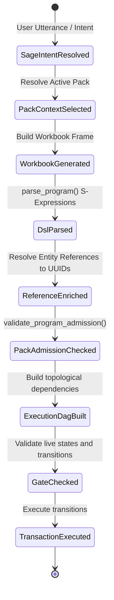

# DSL Agent Validator Skill

This skill governs the compilation and validation loop of the Domain Specific Language (DSL) as it is structured and processed across the system.

## 1. SAGE Agent -> REPL -> DSL Validation FSM Transitions

The validation loop follows a strict state transition sequence:

1. **SageIntentResolved**: Sage matches the user utterance to a specific intent and selects an active `Pack`.
2. **PackContextSelected**: Sage builds the workbook and attaches the `PackDagContext` envelope.
3. **WorkbookGenerated**: The REPL holds the current workbook execution context (pack, snapshot, scenario, domain lens).
4. **DslParsed**: S-expressions are parsed into AST node statements, extracting `:with-lens` overrides.
5. **ReferenceEnriched**: Entity references are resolved to UUIDs and loaded.
6. **PackAdmissionChecked**: The DSL validator checks that all verb calls are in the pack's `allowed_verbs` and resolved workspaces are admitted.
7. **ExecutionDagBuilt**: Builds execution dependency edges (`StateEdge`, `ResourceCoordEdge`).
8. **GateChecked**: `GateChecker` validates that the starting state matches allowed state machine transitions.

---

## 2. Structured Failure Representation

All DSL compilation, parsing, and admission errors must be returned as **structured, strongly-typed AST failure nodes** rather than unstructured, raw string errors:

* **No Loose Strings**: Never propagate raw parser panics or plain string errors up to the user interface.
* **Structured Diagnostics**: Return list of `Diagnostic` / `StructuralError` objects specifying:
  - `DiagnosticCode` (e.g. `VerbNotAdmitted`, `WorkspaceNotAdmitted`, `ArgTypeMismatch`)
  - `Location` / `Span` (line and column bounds in source code)
  - `Message` (informative, developer-actionable description)
  - `Severity` (e.g. `Error`, `Warning`)
* **AstFailureNode**: When parsing fails, construct a placeholder error node in the AST containing the structured error metadata so the compiler pipeline can perform subsequent static analysis and report comprehensive error sets in a single pass.
