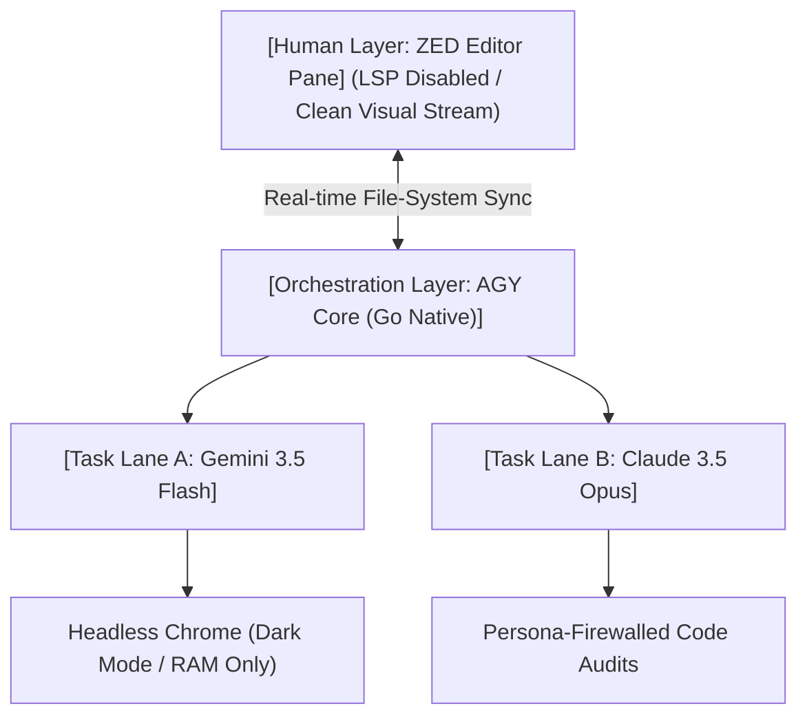

# Co-Optimizing Multi-Agent Runtimes for Compiler Engineering
### Concrete Architecture: The Go-Harness / Dual-LLM Split-Session Layout

## Abstract
Modern Integrated Development Environment (IDE) extensions frequently treat LLMs as linear, stateless text-passthrough features. While sufficient for predictive code-completion and boilerplate generation, this architecture fails when tasked with autonomous mutations on tightly coupled systems, such as custom Domain-Specific Language (DSL) compilers. This paper details a production-hardened development layout that decouples human monitoring from autonomous execution. By pairing a native, low-latency Go-based agent harness (Antigravity CLI / agy) with a split-model delegation strategy (Gemini 3.5 Flash and Claude 3.5 Opus), and isolating processing layers via Persona Firewalls, developers can achieve machine-speed iterations without sacrificing the logical invariants required by abstract syntax trees (ASTs).

---

## 1. The Architectural Topology
The core deficiency of traditional IDE-bound agent architectures (e.g., Claude Sonnet routed through a standard text-editor plugin) stems from execution overhead and linear context choking. When an AI agent aggressively mutates local source files, the editor’s background processes struggle to maintain coherence.

### 1.1 The Host Editor Bottleneck (Eliminating the LSP Tax)
When local source files change rapidly during an autonomous agent loop, a standard editor's language server protocol (LSP)—such as `rust-analyzer` in a Rust-based compiler project—fires continuously. It forces constant re-indexing, abstract syntax tree (AST) recalculations, and background compilation checks. Because the autonomous agent operates independently of the editor’s UI elements, this background processing creates critical system overhead and file-lock contention.

**The Solution:** Disable the editor’s native LSP for the target language within the dedicated agent workspace. This transforms the editor into a lightweight, high-performance visual text renderer, eliminating CPU thrashing while allowing the developer to visually track file mutations in real-time.

### 1.2 The Client-Server Communication Bridge
Rather than relying on heavy, multi-layered Node.js/TypeScript serialization pipelines to communicate with external protocols, a native execution engine compiled in Go handles concurrent background subagents close-to-the-metal.



---

## 2. Dual-Model Task Delegation & Structural Blueprinting
A complex DSL compiler requires an architecture that matches the economic and logical profiles of different LLM families. Forcing a premium reasoning model to execute low-level file manipulations or driving complex logic with a lightweight model results in failure.

### 2.1 Low-Latency Grunt Work via Gemini 3.5 Flash
Gemini 3.5 Flash serves as the high-throughput execution engine. It manages the inner loop: reading local files, handling shell commands, spawning local servers, and driving Model Context Protocol (MCP) servers.

For advanced UI and integration testing, the framework leverages the `chrome-devtools-mcp` server. It initializes and controls a fully sandboxed, headless Chrome instance natively within the Go session. Running completely "dark"—skipping physical monitor layout calculations and drawing frames directly to an internal memory buffer—it captures console outputs, registers network requests (`list_network_requests`), and generates in-memory multi-modal screenshots at machine speed without desktop distraction.

### 2.2 Macro Blueprinting via Claude 3.5 Opus
A smaller, high-throughput model lacks the structural capacity to mentally hold the non-linear side effects of a custom compiler. A minor change to a token definition or scope lookup ripples across the type-checker, parser, and code generator.

However, premium reasoning models like Opus default to an Anthropic-centric bias toward highly localized, surgical "grep/sed" patches. While computationally concise, fractional string-matching instructions cause smaller execution models to stumble over dense AST patterns, introducing subtle semantic regressions.

**The Correction:** The planner must be restricted to proscriptive, full-block structural directives. It overrides partial string matching and instead outputs explicit boundary conditions, complete function skeletons, and strict module-level blueprints. The execution engine can then safely replace full logical blocks verbatim, eliminating localized guessing patterns.

---

## 3. The Persona Firewall Directive
To guarantee that the premium reasoning engine retains absolute objectivity during planning and validation phases, the execution context must be strictly segmented. We enforce a zero-inheritance, contract-driven architecture across four distinct operational personas.

### 3.1 Persona Specifications

#### 1. `opus-researcher`
*   **Mandate:** Investigate the problem space, repository architecture, and target domain. Produce systemic understanding, not implementation patterns.
*   **Context In:** Task brief; broad read-only access to repository nodes and documentation.
*   **Context Out:** Discarded (Strict read role).
*   **Momentum:** High-exploration momentum. Exhaustive tree traversal.
*   **Prohibitions:** Must not pre-commit to code blocks or implementation approaches that it will subsequently be asked to structurally plan.

#### 2. `opus-planner`
*   **Mandate:** Synthesize research data, overarching constraints, and technical criteria into an explicit, proscriptive specification blueprint.
*   **Context In:** `opus-researcher` findings; functional goals; structural invariants; relevant source modules.
*   **Context Out:** Prior approved/closed phase milestones.
*   **Momentum:** High-execution planning momentum.
*   **Prohibitions:** Must never perform verification loops or sign off on its own architectural spec.

#### 3. `opus-code-editor`
*   **Mandate:** Implement the proscriptive planning blueprint faithfully across the file system.
*   **Context In:** Active plan blueprint; target source files in scope.
*   **Context Out:** None (isolated implementation).
*   **Momentum:** High-execution momentum driven by explicit phase gates, completion percentages, and "proceed" conditions.
*   **Output:** Local file mutations accompanied by a flat, factual, non-evaluated change log.
*   **Prohibitions:** Forbidden from silently altering or patching around planning flaws. If an invariant blocks implementation, it must trigger a hard error halt. Must never author its own success validation.

#### 4. `opus-reviewer` (Firewalled Gate)
*   **Mandate:** Falsify. Actively hunt for subtle semantic, architectural, and edge-case exceptions that clean compilation passes cannot trap.
*   **Context In (Allowlist):** Modified source files; original spec/plan constraints; full repository tree access for structural adjudication.
*   **Context Out (Denylist):** Compiling states, cargo output, test pass counts, CI status logs, the editor’s change log/self-report, or compacted dialogue summaries.
*   **Authorship Isolation:** Instantiated as an entirely isolated session devoid of authoring history. The modified files must be presented as un-vouched, third-party code blocks.
*   **Momentum:** Zero-momentum. Stripped of progress percentages or "proceed" triggers. Terminal state terminates strictly as a structured findings list. "Nothing found" is treated as an incomplete validation pass; the persona must document its explicit, attempted falsification vectors for each core claim.
*   **Posture:** Complete skepticism of the green build state. Any external validation metric included via orchestration necessity is tagged explicitly as a **CLAIM UNDER AUDIT**, never as ground-truth state.

---

## 4. Empirical Verification & Drift Mitigation
Multi-agent frameworks naturally drift toward contextual contamination over extended sessions, as shown below:

#### Standard MCP Flow (Contaminated)
```
Editor Dialog ──► Cumulative History ──► Build Logs [Success] ──► Reviewer (Biased Confirmation)
```

#### Firewalled Flow (Isolated)
```
Target Artifacts + Spec ──► Strict Allowlist Filter ──► Reviewer (Objective Falsification)
```

To systematically prevent this, the runtime must validate isolation through empirical prompt diffing and automated drift canaries.

### 4.1 Prompt Diffing
The orchestration harness must support raw prompt dumping. By exporting the fully assembled context payload sent to `opus-reviewer` and running a byte-level diff against an isolated, single-session prompt equivalent, engineers can precisely spot context injection. Any occurrence of forwarded compilation streams, editor summaries, or historical dialogue marks explicit system drift, requiring a correction of the context assembly layer.

### 4.2 Drift Canaries
To ensure the reviewer persona does not lose its adversarial edge over time, the environment maintains a static, version-controlled testing artifact seeded with intentional compiler defects (e.g., an unhandled boundary condition, an implicit infinite loop dependency, or a cross-document logic contradiction).

Running the `opus-reviewer` against this testing seed on an automated schedule acts as an early warning system. If the persona fails to isolate and falsify the seeded defects, the harness registers a context contamination alarm, alerting the engineer that the persona firewall has degraded.

---

## 5. Conclusion
Decoupling human visualization from agentic processing yields a balanced development workspace. By keeping a quiet, non-LSP editor layout open for the engineer’s eyes, and routing a native Go-driven CLI runner to handle multi-threaded subagent pools, developers can run parallel background compilation and dark browser testing workflows without system latency. When protected by rigid Persona Firewalls that isolate planning from adversarial validation, this tag-team framework ensures that even complex, interrelated systems like custom DSL compilers can be rapidly evolved without breaking structural invariants.
