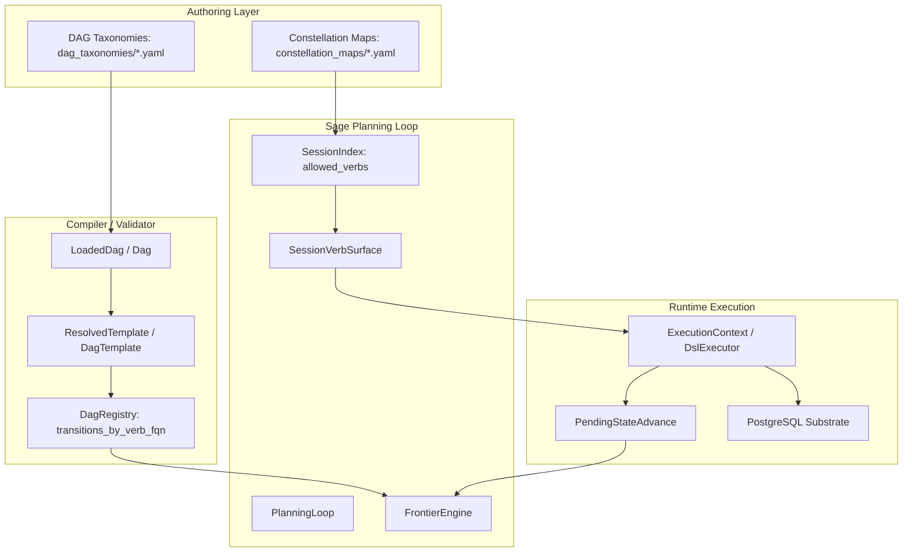

# Sage-NOM Round-Trip Pipeline and Gaps Audit

This audit outlines the round-trip execution flow, database mappings, and structural gaps between **NOM (Network/Object Metadata) taxonomies** — specifically the DAG lifecycles in the compiler and the SemOS semantic graphs/constellation maps — and the **Sage planning runtime**. 

---

## 1. Architectural Concept: Dual Taxonomy Usage

The platform uses two distinct representations of Network/Object Metadata (NOM) to manage lifecycle states, business logic, and semantic matching:



### 1.1 The DAG Lifecycle Plane (Compiler & Validator)
* **Typed Structs**: `dsl_types::dag::Dag` and `dsl_types::dag::Slot` (in `crates/dsl_types/src/dag.rs`).
* **Purpose**: Declares overall workspace lifecycles, states, and transitions. It defines the sequencing rules using `green_when` logic, `state_dependency` constraints, `cross_workspace_constraints`, and progression triggers (`via: verb_fqn`).
* **Lookup Index**: `DagRegistry` compiles these rules into `transitions_by_verb_fqn` to answer the question: *"what transitions could this verb cause at the compiler level?"*

### 1.2 The Constellation Map Plane (Semantic & Hydration)
* **Typed Structs**: `dsl_types::constellation_map_def::SeedConstellationMap`, `ConstellationMapDefBody`, and `SlotDef` (in `crates/dsl_types/src/constellation_map_def.rs`).
* **Purpose**: Maps logical slots to physical database entities. It defines table mappings, primary keys, parent/child relationships (`SlotDef::children`), and a per-state **Verbs Palette** specifying which DSL verbs are allowed when the slot is in a given state.
* **Hierarchy**: The slot hierarchy is hierarchical (using nested `BTreeMap<String, SlotDef>`), ensuring segment-by-segment dot-path resolution.

### 1.3 The Sage State Graph (Planning Runtime)
* **Location**: `ob-poc-agent::planning::PlanningLoop` (in `crates/ob-poc-agent/src/planning.rs`).
* **Purpose**: Evaluates the *current* state of hydrated database entities against the constellation maps and active packs to constrain LLM options. It projects a `SessionVerbSurface` representing only the verbs that are legally executable in the current turn.

---

## 2. In-Depth Round-Trip Call Stack & Data Flow Pipeline

When an editor provides a natural language prompt, the system traverses a multi-layer pipeline to resolve, validate, execute, and record the state change:

### 2.1 The Request/Planning Stack
```text
POST /api/session/:id/input
  │ (api/agent_routes.rs: SessionInputRequest::Utterance)
  ▼
agent_service::process_chat(session_id, utterance)
  │
orchestrator::handle_utterance(ctx, utterance)  (rust/src/agent/orchestrator.rs)
  │
  ├── 1. Context Hydration
  │    ConstellationHydrator::hydrate(scope) -> ConstellationSnapshot
  │      (Retrieves DB values representing entity states)
  │
  ├── 2. Precondition Analysis & Frontier Compilation
  │    FrontierEngine::compute(&index, &snapshot) -> Frontier
  │      (Determines which DAG slots are currently unresolved or active)
  │
  ├── 3. Substrate Knowledge Fetch
  │    SemOsKnowledgeClient::query(active_verbs_query) -> KnowledgeResponse::Verbs
  │      (Retrieves the active allowed verb list from the live substrate)
  │
  ├── 4. Intersection & Allowlist Locking
  │    orchestrator::compute_effective_allowlist() -> HashSet<String>
  │      (Intersects pack allowlist, substrate active verbs, and excludes refused_drafts)
  │
  ├── 5. Blocker Detection
  │    BlockerDetector::detect(index, frontier, snapshot, None) -> Vec<Blocker>
  │      (Identifies missing data dependencies or process blocks)
  │
  ├── 6. Intent Classification (Sage)
  │    llm_sage::classify_intent(utterance, context) -> OutcomeIntent
  │      (Translates prompt into a plane/domain/action mapping, WITHOUT picking verb FQNs)
  │
  └── 7. Action Codification (Coder)
       coder::resolve_action(intent, effective_allowlist) -> CoderResult
         (Performs local semantic matching using BGE-small embeddings via Candle,
          calls LLM for parameter/arg extraction, and outputs draft DSL code)
```

### 2.2 The Validation & Execution Stack
```text
(If AgentMode is Governed -> staged for user approval. If auto-execute -> direct run)
  │
repl_routes_v2::handle_repl_input(staged_dsl)
  │
DslExecutor::execute(dsl_ast)  (rust/src/dsl_v2/executor.rs)
  │
  ├── 1. Pre-dispatch Gates
  │    GateChecker::check(verb_fqn, execution_context)
  │      (Asserts actor permissions, roles, and pre-execution schema invariants)
  │
  ├── 2. Registry Dispatch Lookup
  │    SemOsVerbOpRegistry::get_handler(verb_fqn) -> SemOsVerbOp
  │
  ├── 3. SQLx Substrate Write (Handler)
  │    simple_status_op::STATUS_FLIP_VERBS / GenericCrudExecutor / Custom Ops
  │      (Executes UPDATE or INSERT SQL against the database)
  │
  └── 4. State-Advance Event Emission
       emit_pending_state_advance(PendingStateAdvance)
         (Emitted from the SQL handler to the DAG engine to trigger downstream transitions)
```

---

## 3. Data Domain Coverage (CBU, OnBoarding, KYC)

The dual taxonomies structure the entity representations across three major domains:

### 3.1 Client Business Unit (CBU) Domain
* **Active Pack**: `cbu-maintenance.yaml`, `book-setup.yaml`
* **Canonical Constellation**: `cbu_workspace` (composed from `group.ownership`, `struct.*`, `kyc.onboarding`)
* **State Machine Lifecycles**:
  * **CBU lifecycle** (`cbu_dag.yaml`): `DRAFT` ➔ `VALIDATED` ➔ `PENDING_REVIEW` ➔ `ACTIVE` ➔ `SUPERSEDED` ➔ `ARCHIVED`.
  * **Corporate Action Event** (`cbu_ca`): `INITIATED` ➔ `SUBMITTED` ➔ `APPROVED`/`REJECTED` ➔ `IMPLEMENTED`.
* **Database Backing Tables**:
  * `cbus` (core business unit metadata)
  * `cbu_entity_roles` (links entities like partners, investment managers, and custodians to CBUs)
  * `cbu_corporate_action_events` (tracks corporate restructuring)
  * `cbu_trading_profiles` and `cbu_settlement_chains` (trading parameters)

### 3.2 OnBoarding Domain
* **Active Pack**: `onboarding-request.yaml`, `deal-lifecycle.yaml`
* **Canonical Constellation**: `kyc_onboarding`
* **State Machine Lifecycles**:
  * **Deal lifecycle** (`deal_dag.yaml`): `PROSPECT` ➔ `CONTRACTED` ➔ `ACTIVE` ➔ `SUSPENDED` ➔ `OFFBOARDED`.
  * **Clearance lifecycle**: `PENDING` ➔ `IN_CLEARANCE` ➔ `APPROVED`/`REJECTED`.
* **Database Backing Tables**:
  * `deals` (commercial container)
  * `deal_items` (associated products/fees)
  * `deal_onboarding_requests` (tracks operational onboarding requests spawned by deals)
  * `booking_principal_clearances` (tracks credit/compliance selection clearance states)

### 3.3 Know Your Customer (KYC) Domain
* **Active Pack**: `kyc-case.yaml`
* **Canonical Constellation**: `kyc_extended`
* **State Machine Lifecycles**:
  * **KYC Case lifecycle** (`kyc_dag.yaml`): `NOT_STARTED` ➔ `IN_PROGRESS` ➔ `UNDER_REVIEW` ➔ `APPROVED` ➔ `REJECTED`.
  * **Evidence Checklist lifecycle**: `evidence.yaml` (attaching, verifying, waiving document requirements).
  * **Red Flags**: `red-flag.yaml` (escalating and resolving risk alerts).
* **Database Backing Tables**:
  * `kyc.cases` (the onboarding/monitoring workflow shell)
  * `kyc.entity_workstreams` (segment-specific verification reviews)
  * `kyc.ubo_registry` (normalized beneficial owner registry entries)
  * `kyc.ubo_evidence` (links document metadata to beneficial owner requirements)
  * `kyc.ubo_determination_runs` (JSONB cache of ownership calculations and identified gaps)

---

## 4. Gaps in the Round-Trip Execution Loop

A detailed code-and-schema audit reveals four critical gap classes where the round trip breaks between YAML specifications, Sage planning, and database entities:

### 4.1 Schema-Migration Drift (P0 Broken Verbs)
The runtime registry (`simple_status_op.rs`) declares status-flip verbs that write to the DB, but they fail compile-time or runtime checks due to drift between SQL schemas and code:
1. **Column-Name Drift**: Verbs like `cbu-ca.approve` write to a `status` column, but the database column in `cbu_corporate_action_events` is named `ca_status`, causing SQL errors on invocation.
2. **CHECK Constraint Mismatches (Enum Drift)**: Verbs like `trading-profile.enter-parallel-run` write the state `PARALLEL_RUN` to `cbu_trading_profiles.status`. However, the DB check constraint `cbu_trading_profiles_status_check` only accepts `(DRAFT, VALIDATED, PENDING_REVIEW, ACTIVE, SUPERSEDED, ARCHIVED)`. This results in hard Postgres check violations.
3. **Column-Missing Gaps**: Verbs in the `settlement-chain` family attempt to write to `status`, but the table `cbu_settlement_chains` only has a boolean `is_active` column, causing database updates to fail.

### 4.2 Closure Gaps in Precondition Graph (Missing Writers)
The DAG lifecycles require specific state criteria to progress transitions, but no SemOS verbs exist to write them:
1. **Commercial Blockers**: Progression from `IN_CLEARANCE` to `CONTRACTED` in `deal_dag.yaml` demands `deal_rate_card.status = AGREED`. However, no `SemOsVerbOp` or CRUD handler updates rate card statuses.
2. **Operational Blockers**: Moving a deal to `ACTIVE` requires `deal_onboarding_requests.request_status = COMPLETED`, but there is no registered verb to update this status.
3. **Investor Onboarding Blockers**: Progression in `cbu_dag.yaml` for investors requires `investor_kyc.status = APPROVED`, but the UBO/KYC pipeline lacks a registered status writer.

### 4.3 Cascade Pattern Violations (Registry Bypass)
Several legacy plugin verbs directly alter database tables of other domains via inline SQL instead of dispatching sub-actions through the SemOS registry:
1. **`cbu.delete-cascade`**: Directly executes deletes on `cbu_group_members`, `cbu_structure_links`, and `cbu_entity_roles` instead of invoking `cbu.unlink-structure` or `cbu-role.terminate` through the registry.
2. **`cbu.decide`**: Directly updates `cases` status in-line, bypassing the `kyc-case.update-status` verb and preventing the DAG state-reducer from emitting downstream advance events.
3. **`cbu.add-product`**: Directly inserts rows into `cbu_resource_instances` instead of dispatching resource-provisioning verbs.

### 4.4 Substrate-Discovery Disconnection
The discovery pipeline (`service_pipeline.rs`) reads SemOS-governed variables but writes outcomes directly to non-governed cached tables (`srdef_discovery_reasons`, `readiness_results`, `attribute_values`). 
* Because these verbs do **not** call `emit_pending_state_advance`, the compiler's DAG registry is never notified when discovery runs or finishes.
* There is no `cbu_discovery_state` slot in the DAG. As a result, Sage cannot answer whether a CBU's discovery cycle is in progress or complete using state-machine logic, forcing it to inspect raw database rows to make planning decisions.
* YAML declares lifecycle verbs `service-intent.suspend`, `resume`, and `cancel`, but they remain entirely unwired in the Rust execution code.
